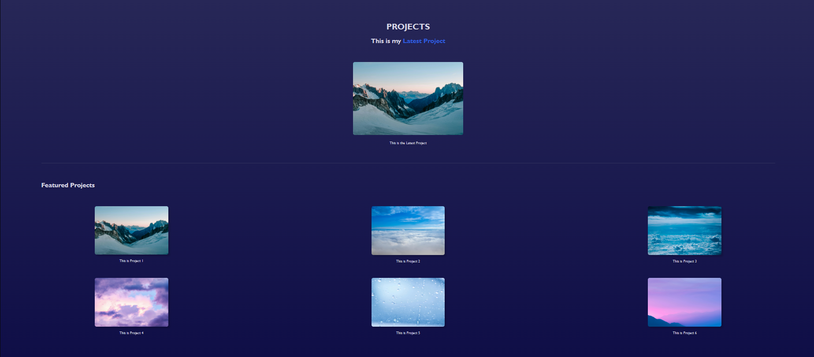
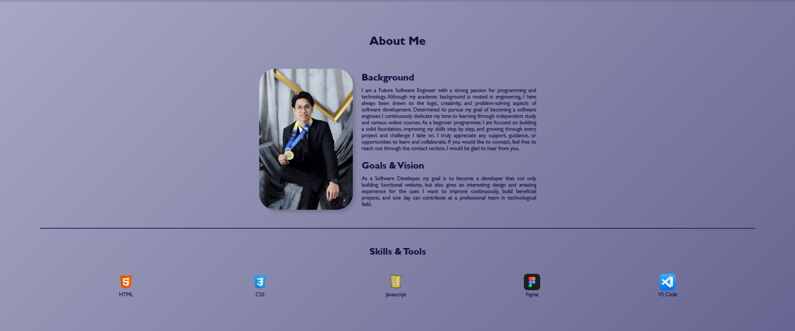
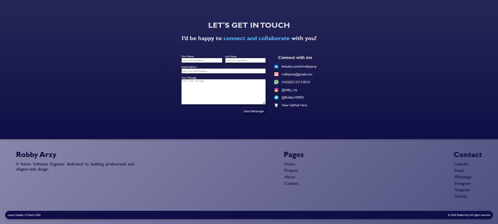
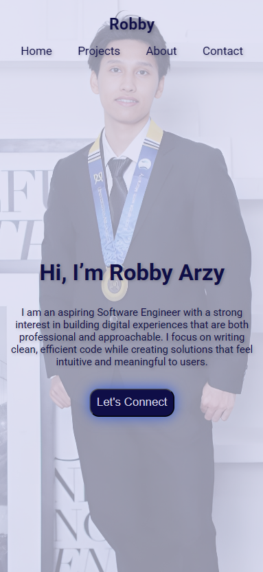
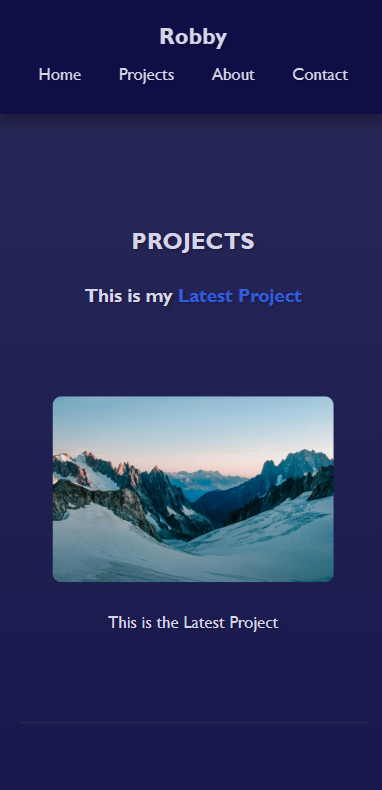
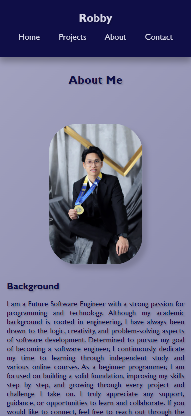
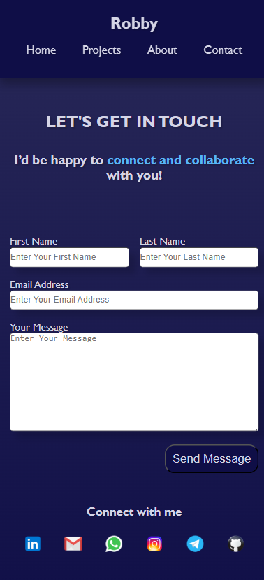

# Personal Portfolio

---

🔗 [View Live Personal Portfolio Website](https://revou-fsse-feb26.github.io/milestone-1-Arzy4/)

---

## Overview

This website serves as a **personal portfolio** project representing my journey, technical skills, and creative projects. It is thoughtfully organized into distinct sections, including an introductory Home section, About section detailing my background and aspirations, Projects section highlighting my work, and Contact section offering multiple ways to connect. The site is built with modern web standards for a clean, responsive, and user-friendly experience across devices. This portfolio provides a comprehensive view of who I am, what I can do, and how to reach me.

---

## Key Features

This website is designed to demonstrate my abilities as a Software Engineer and Web Developer. As for now, the website shows my skill in HTML and CSS. There are several types of features implemented in this website such as:

1. Interactive Home section: Serves as the **main entry point**, offering a brief introduction and a preview of the latest project.
2. Detailed About section: Shares a personal **biography**, **educational background**, and the **journey into software development**.
3. Featured Projects: This section **presents all projects** that demonstrate my technical skills, problem-solving abilities, and growing experience in building modern web applications.
4. Multi-Channel Contact Options: Integrates **direct links** to LinkedIn, Email, WhatsApp, Instagram, and Telegram for **easy communication**.
5. Clean, Responsive Design: **Built with HTML and CSS** to provide a visually appealing and accessible layout across devices.
6. CSS Styling and Layout Techniques: The website uses **modern CSS techniques** such as Flexbox for layout structuring, CSS variables for consistent design values, hover effects and transitions for interactive elements, box shadows and gradients for visual styling, and responsive media queries to ensure the website adapts smoothly across different screen sizes.

### Responsive Design Implementation

This website is designed to be fully responsive across various screen sizes using CSS media queries.

Key implementations include:
- Use of media queries to adjust layout for mobile, tablet, and desktop screens
- Flexible layouts using Flexbox and Grid to maintain structure
- Responsive image scaling using max-width and percentage-based sizing
- Adaptive spacing and alignment to ensure readability on smaller devices
- Carousel feature for Skills & Projects optimized for screens ≤1200px

### New Update

This portfolio includes new updates with additional features such as:

- Introduced a **new color theme** to improve visual consistency across the website. 
- **Enhanced the background** with a more engaging gradient design to create a more appealing user interface.
- **Redesigned the portfolio layout** for better structure and improved user experience.
- Added **“Skills & Tools” section** to the About page to highlight technical competencies and technologies used.
- Added **responsive carousel** for Skills & Tools icons and Project cards (≤1200px screen width).
- Added a **call-to-action button** in the Home section to make it easier for visitors to navigate to the Contact section.

---

## Tools and Technologies

The development of this website involved the use of several tools and technologies to **ensure a clean structure, responsive design, and smooth user experience**. Each element was carefully built and styled to create a professional yet welcoming interface, reflecting both technical learning and creative exploration throughout the process.

1. **Tools**
    - Visual Studio Code (VS Code): Use as Code Editor for **writing and editing the program** such as HTML and CSS code.
    - Opera GX: Web Browser use for **previewing and testing website** during development.
    - GitHub: A platform used to **store, manage, and share** the project repository online.

2. **Technologies**
    - HTML for website structure, focusing on semantic HTML  
    - CSS for website style, using Flexbox, Grid, Media Queries, Transitions
    - JavaScript for interactivity

---

## CSS Implementation Highlights

- Responsive layouts using Flexbox and Grid
- Use of media queries to handle multiple breakpoints
- Consistent spacing using reusable CSS values
- Interactive elements using hover effects and transitions
- Background gradients and shadows for visual depth

---

## How to Deploy and Access the Website

### Deployment

This website is deployed using GitHub Pages by following these steps:

1. Navigate to your repository on GitHub
2. Open "Settings"
3. Go to "Pages" section
4. Under "Source", select "Deploy from branch"
5. Choose main branch and root directory
6. Click save

After a few minutes, GitHub Pages will automatically build and publish the website. A live URL will be generated and displayed at the top of the Pages settings.

### Live Website

My Personal Portfolio Website is now live and can be accessed through the link below:

`https://revou-fsse-feb26.github.io/milestone-1-Arzy4/`

Once opened, users can navigate through the main sections of the website:

- **Home** – Introduction for visitors
- **About** – Information about my background and journey
- **Projects** – A showcase of projects I have worked on
- **Contact** – A form and links to reach me through various platforms

--- 

## Website Screenshot

### Desktop View

#### Home Section

#### Project Section

#### About Section

#### Contact Section

### Mobile View

#### Home Section

#### Project Section

#### About Section

#### Contact Section

