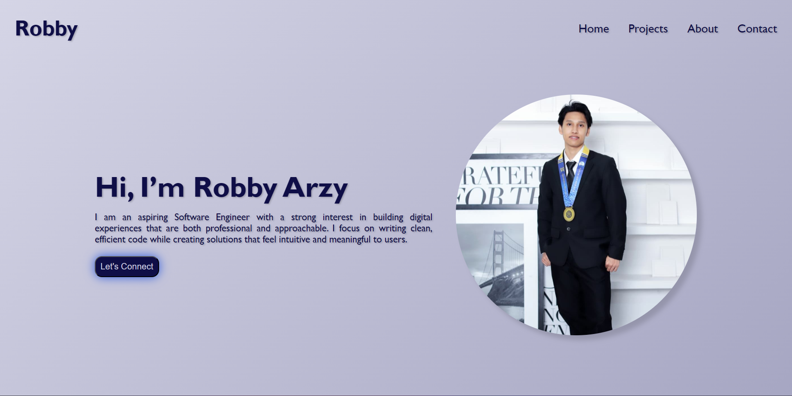

# Personal Portfolio

---

🔗 [View Live Personal Portfolio Website](https://revou-fsse-feb26.github.io/milestone-1-Arzy4/)

---

## Welcome to My Website Portfolio

This website serves as a **personal portfolio** to present my journey, technical skills, and creative projects. It is thoughtfully organized into distinct sections, including an introductory Home section, About section detailing my background and aspirations, Projects section highlighting my work, and Contact section offering multiple ways to connect. The site is built with modern web standards for a clean, responsive, and user-friendly experience across devices. This portfolio provides a comprehensive view of who I am, what I can do, and how to reach me.

---

## Key Features

This website is designed to demonstrate my abilities as a Software Engineer and Web Developer. As for now, the website shows my skill in HTML and CSS. There are several types of features implemented in this website such as:

1. Interactive Home section: Serves as the **main entry point**, offering a brief introduction and a preview of the latest project.
2. Detailed About section: Shares a personal **biography**, **educational background**, and the **journey into software development**.
3. Featured Projects: This section **presents all projects** that demonstrate my technical skills, problem-solving abilities, and growing experience in building modern web applications.
4. Multi-Channel Contact Options: Integrates **direct links** to LinkedIn, Email, WhatsApp, Instagram, and Telegram for **easy communication**.
5. Clean, Responsive Design: **Built with HTML and CSS** to provide a visually appealing and accessible layout across devices.
6. CSS Styling and Layout Techniques: The website uses **modern CSS techniques** such as Flexbox for layout structuring, CSS variables for consistent design values, hover effects and transitions for interactive elements, box shadows and gradients for visual styling, and responsive media queries to ensure the website adapts smoothly across different screen sizes.

### Future Improvements

This portfolio will continue to evolve with additional features such as:

- Improved mobile responsiveness
- JavaScript interactivity
- More featured projects
- Performance optimizations

### New Update
- New color theme
- Engaging background color
- New Portfolio layout
- Add "SKillS & TOOLS" in About section 

---

## Tools and Technologies

The development of this website involved the use of several tools and technologies to ensure a clean structure, responsive design, and smooth user experience. Each element was carefully built and styled to create a professional yet welcoming interface, reflecting both technical learning and creative exploration throughout the process.

1. **Tools**
    - Visual Studio Code (VS Code): Use as Code Editor for writing and editing the program such as HTML and CSS code.
    - Opera GX: Web Browser use for previewing and testing website during development.
    - GitHub: A platform used to store, manage, and share the project repository online.

2. **Technologies**
    - HTML: Markup language used to structure the content of the website.
    - CSS: Style sheet language used to design and layout the website, making the website more appealing.

---

## How to Access the Website

The website is deployed using GitHub Pages and can be accessed through the following link:

`https://revou-fsse-feb26.github.io/milestone-1-Arzy4/`

Once opened, users can navigate through the main sections of the website:

1. **Home** – Introduction for visitors
2. **About** – Information about my background and journey
3. **Projects** – A showcase of projects I have worked on
4. **Contact** – A form and links to reach me through various platforms
